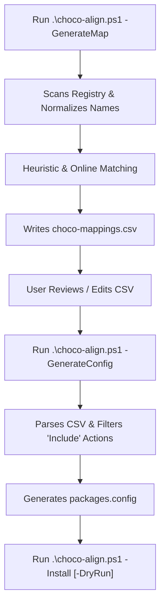

# ChocoAlign

`ChocoAlign` is a PowerShell-based utility designed to scan installed Windows applications, align them with equivalent Chocolatey packages using intelligent heuristics, and output them to a standard, user-editable CSV. Once reviewed, it generates a native `packages.config` file to sync or restore the applications easily.

---

## Key Features

1. **Dual-Path Registry Scanning**: Scans both 64-bit and 32-bit (Wow6432Node) HKLM and HKCU registry pathways.
2. **Filtered Scanning**: Automatically excludes system components, updates (KB files), language packs, and parent-sub-components to keep mappings clean.
3. **Word-Boundary Heuristic Matching**: Uses regular expression word boundaries (`\b`) to match names accurately against static mappings without accidental substring false positives (e.g., preventing "digital" matching to "git").
4. **Editable CSV Interface**: Saves candidate matches to a user-friendly `choco-mappings.csv` file, allowing you to manually verify, correct, or exclude (`Ignore`) packages.
5. **Preserved User Modifications**: Remapping scans dynamically merge with existing CSV files, preserving your manual adjustments.
6. **Chocolatey Integration**: Generates native `packages.config` files for direct ingestion via `choco install`.

---

## Workflow Diagram



---

## File Architecture

* **[choco-align.ps1](file:///d:/Git/choco-sync/choco-align.ps1)**: CLI Entry Point runner script. Routes flags and displays visual status indicators.
* **[src/ChocoAlign.psm1](file:///d:/Git/choco-sync/src/ChocoAlign.psm1)**: Core PowerShell module containing logic functions.
* **[choco-mappings.csv](file:///d:/Git/choco-sync/choco-mappings.csv)**: Generated file containing scanned applications, proposed package IDs, and action settings (*Git-Ignored*).
* **[packages.config](file:///d:/Git/choco-sync/packages.config)**: Output configuration file (*Git-Ignored*).
* **[.gitignore](file:///d:/Git/choco-sync/.gitignore)**: Standard gitignore ensuring runtime outputs are not committed.

---

## Prerequisites

* **Operating System**: Windows 10/11 or Windows Server.
* **Shell**: PowerShell 5.1 or PowerShell Core (7+).
* **Package Manager**: [Chocolatey](https://chocolatey.org/) (optional, required to run the final install commands).

---

## Usage Guide

### Step 1: Scan and Map Local Applications
Run the scanner to generate the initial mapping CSV:
```powershell
.\choco-align.ps1 -GenerateMap
```
*Optional:* To query the Chocolatey community repository online for matching package validation (slower but covers more packages):
```powershell
.\choco-align.ps1 -GenerateMap -OnlineSearch
```

### Step 2: Edit Mappings
Open `choco-mappings.csv` in Excel, VS Code, or Notepad:
- Verify that **`ChocoPackageId`** matches the package you want.
- Set **`Action`** to `Include` to sync the package, or `Ignore` to skip it.
- Save the file.

### Step 3: Generate Packages Configuration
Produce the standard Chocolatey XML file:
```powershell
.\choco-align.ps1 -GenerateConfig
```

### Step 4: Sync/Restore Packages
To simulate the installation (dry-run):
```powershell
.\choco-align.ps1 -Install -DryRun
```
To execute the actual installation:
```powershell
.\choco-align.ps1 -Install
```

---

## AI Agent Developer Integration Guide

If you are an AI coding assistant (e.g. Cursor, Windsurf, Antigravity) working on this repository, please adhere to these guidelines:

### Core Module API
The functions are defined inside `src/ChocoAlign.psm1` and exported to the runner:
* `Get-InstalledApps`: Returns a list of objects with properties `[string]AppName`, `[string]Publisher`, `[string]DisplayVersion`.
* `Search-ChocoPackage`: Takes `AppName`, `Publisher`, and a switch `OnlineSearch`. Returns custom object `[string]ChocoId`, `[string]Confidence` (High, Medium, Low, None), and `[string]Source`.
* `Export-MappingCsv`: Merges scanned applications with the existing CSV at the specified path and writes a new CSV.
* `New-ChocoConfig`: Parses CSV paths, filters out non-included rows, and writes to `packages.config` XML.
* `Invoke-ChocoInstall`: Wraps calls to `choco install <config> -y` with optional `--noop` dry-runs.

### Codebase Modifications
* **Maintaining Multi-Word Matching**: When adding new entries to `$CommonMappings` (the static dictionary in `src/ChocoAlign.psm1`), use lowercase names. The search function matches keys against lowercased registry display names using regex boundaries to avoid substring matching issues.
* **Testing Syntax changes**:
  Before committing changes to the PowerShell module or runner script, verify correctness using:
  ```powershell
  Get-Command -Syntax .\choco-align.ps1
  ```
* **Git Practices**: Keep `.gitignore` updated with any temporary log files or artifacts generated during debugging.
